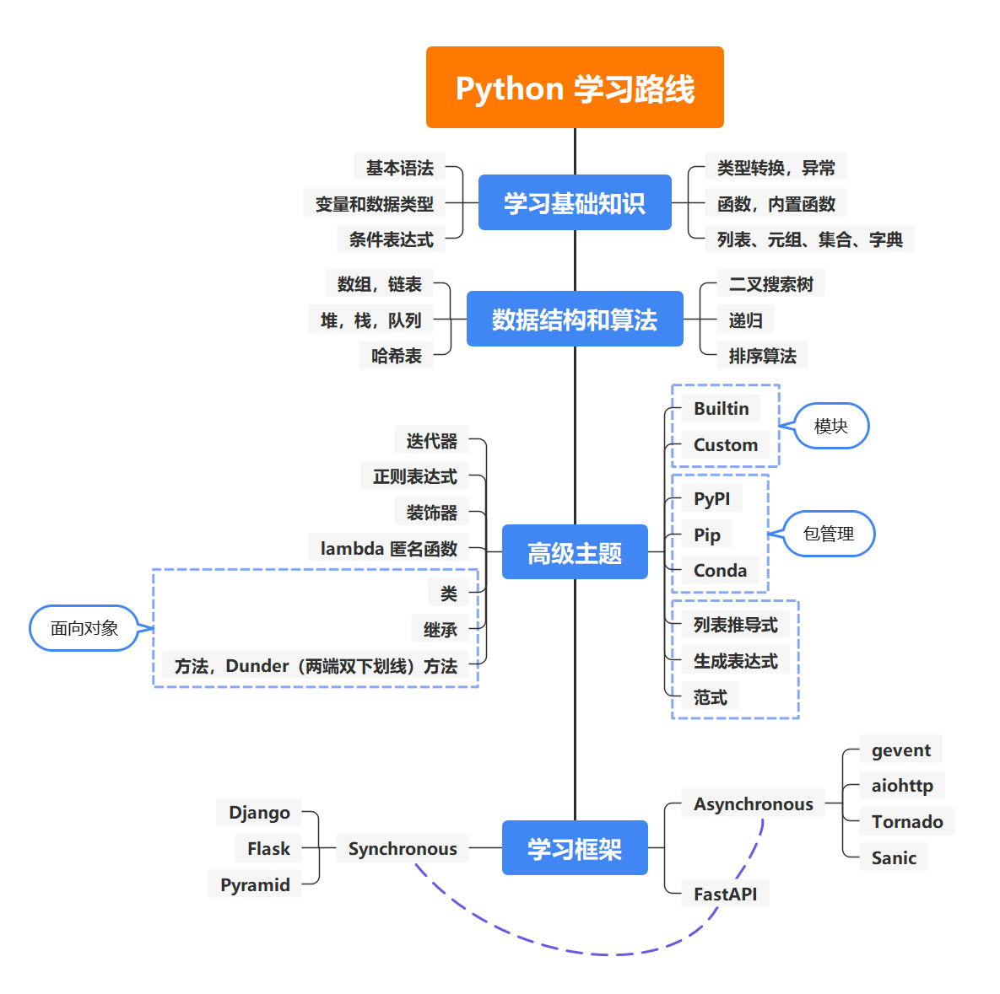

# Python 学习


##  Python 安装

**1. 下载安装包**

官网下载：https://www.python.org/downloads/

Python 3.8.10：https://www.python.org/ftp/python/3.8.10/python-3.8.10-embed-amd64.zip

国内镜像源：https://mirrors.huaweicloud.com/python/

**2. 解压安装包**

```cmd
# 解压到 C:\devops\Python38 目录下
C:\Users\59411\Downloads>7z x python-3.8.10-embed-amd64.zip -o"C:\devops\Python38"
```

**3. 验证安装是否成功**

```cmd
# 1. 进入安装目录
C:\Users\59411\Downloads>cd C:\devops\Python38
# 2. 查看 Python 版本号
C:\devops\Python38>python --version
Python 3.8.10 # 正常显示版本号表示安装成功
```

**4. 添加环境变量**

快捷键 `Win + R` -> 打开：`sysdm.cpl` -> 高级 -> 环境变量

​	找到`系统变量`Path，编辑 -> 新建 -> 输入 Pyton 安装目录 `C:\devops\Python38`

<font color=blue>注意：如果 Path 变量中设置了其他 Python 版本的路径，需要把当前要设置的放在最前面才会生效。</font>

**5. 验证环境变量是否生效**

```cmd
# 在任意目录下执行 python 命令，进入 python 交互模式
C:\Users\59411>python
Python 3.8.10 (tags/v3.9.13:6de2ca5, May 17 2022, 16:36:42) [MSC v.1929 64 bit (AMD64)] on win32
Type "help", "copyright", "credits" or "license" for more information.
>>> "hello python"
'hello python'
>>> ^Z  # Ctrl + Z 退出交互模式
```

### 其他必装工具包

> **pip**
>
> - https://pip.pypa.io/en/stable/installation/
>
> **pipenv**
>
> - https://github.com/pypa/pipenv
>
> - https://pipenv.pypa.io/en/latest/
>
> - Note: 需要设置环境变量 `WORKON_HOME`作为虚拟环境的存储目录

## 学习路线图

> GitHub - 开发人员学习路线图（stars 24.8w+），并附有学习资源
>
> - https://roadmap.sh/python



### 学习资料

Python 官方文档（英文）

- https://docs.python.org/3/index.html

apiref.com 中文的 Python 文档

- https://www.apiref.com/python-zh/index.html

GitHub - Python 100 天从新手到大师（stars 13.9w+）

- https://github.com/jackfrued/Python-100-Days/tree/master

GitHub 总榜第 1 的免费编程学习营地

- https://www.freecodecamp.org/learn/scientific-computing-with-python/

GitHub 总榜第 2 的学习资源列表

- https://github.com/EbookFoundation/free-programming-books/blob/main/books/free-programming-books-zh.md#python

## Python 入门

### 学习资源

> imooc - Python3 入门教程（新版）
>
> - http://www.imooc.com/learn/1261
>
> imooc - Python 入门语法教程
>
> - http://www.imooc.com/wiki/pythonlesson1
>
> HackerRank
>
> - https://www.hackerrank.com/domains/python
>
> 牛客网 - Python 学习教程
>
> - https://www.nowcoder.com/tutorial/10005/dc2c82d6557548beb0e2252869be13d8
>
> 廖雪峰 - 小白的 Python 新手教程
>
> - https://www.liaoxuefeng.com/wiki/1016959663602400
>
> 牛客网 - Python 学习视频
>
> - https://www.nowcoder.com/courses/cover/vod/1004
>
> 中国大学MOOC - Python语言程序设计（北京理工大学）【国家精品】
>
> - https://www.icourse163.org/course/BIT-268001
>
> 阿里云大学 - Python入门 2020年版
>
> - https://edu.aliyun.com/course/314509
>
> w3schools - Python 教程
>
> - https://www.w3schools.com/python/default.asp

## Python 进阶

### 学习资料

> imooc - Python 进阶应用教程
>
> - http://www.imooc.com/wiki/pythonlesson2
>
> 牛客网 - Python 学习教程
>
> - https://www.nowcoder.com/tutorial/10005/405978e43980483691016271ac34c9f8
>
> 廖雪峰 Python 进阶教程
>
> - https://www.liaoxuefeng.com/wiki/1016959663602400/1017269809315232
>
> GitHub - Python 100 天从新手到大师（stars 13.9w+）
>
> - https://github.com/jackfrued/Python-100-Days/tree/master
>
> GitHub 总榜第 2 的学习资源列表 - Django 教程
>
> - https://github.com/EbookFoundation/free-programming-books/blob/main/books/free-programming-books-zh.md#django
>
> imooc - Python 原生爬虫教程
>
> - http://www.imooc.com/wiki/pythonspider
>
> imooc - 爬虫框架 Scrpary 入门教程
>
> - http://www.imooc.com/wiki/scrapylesson
>
> imooc - Web 框架 Django 入门教程
>
> - http://www.imooc.com/wiki/djangolesson
>
> imooc - Web 框架 Flask 入门教程
>
> - http://www.imooc.com/wiki/flasklesson
>
> imooc - 科学计算库 Numpy 入门教程
>
> - http://www.imooc.com/wiki/numpylesson
>
> imooc - 科学计算库 Pandas 入门教程
>
> - http://www.imooc.com/wiki/pandasless
>
> imooc - 机器学习框架 TensorFlow 入门教程
>
> - http://www.imooc.com/wiki/tensorflow
>
> imooc - Python 办公自动化教程
>
> - http://www.imooc.com/wiki/officeautomation

## Python 应用实战

### 学习资料

#### Python 全能工程师

- https://class.imooc.com/sale/python2023

#### Web 开发

- https://coding.imooc.com/learningpath/route?pathId=22

- https://coding.imooc.com/learningpath/route?pathId=33
- https://coding.imooc.com/learningpath/route?pathId=34
- https://coding.imooc.com/learningpath/route?pathId=35

#### 爬虫

- https://coding.imooc.com/learningpath/route?pathId=23

#### 量化交易

- https://coding.imooc.com/learningpath/route?pathId=57

#### 人工智能

- https://coding.imooc.com/learningpath/route?pathId=28
- https://class.imooc.com/sale/ai

#### Go+Python打造电商系统

https://coding.imooc.com/class/chapter/469.html#Anchor
